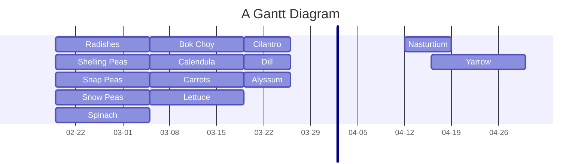

# Planting Schedule

```mermaid
---
displayMode: compact
---
gantt
    title A Gantt Diagram
    dateFormat YYYY-MM-DD
    axisFormat %m-%d
    Last Frost: vert, v1, 2026-04-02,
    Radishes: 2026-02-19, 14d
    Shelling Peas: 2026-02-19, 14d
    Snap Peas: 2026-02-19, 14d
    Snow Peas: 2026-02-19, 14d
    Spinach: 2026-02-19, 14d
    Bok Choy: 2026-03-05, 14d
    Calendula: 2026-03-05, 14d
    Carrots: 2026-03-05, 14d
    Lettuce: 2026-03-05, 14d
    Cilantro: 2026-03-19, 7d
    Dill: 2026-03-19, 7d
    Alyssum: 2026-03-19, 7d
    Nasturtium: 2026-04-12, 7d
    Yarrow: 2026-04-16, 14d
```
