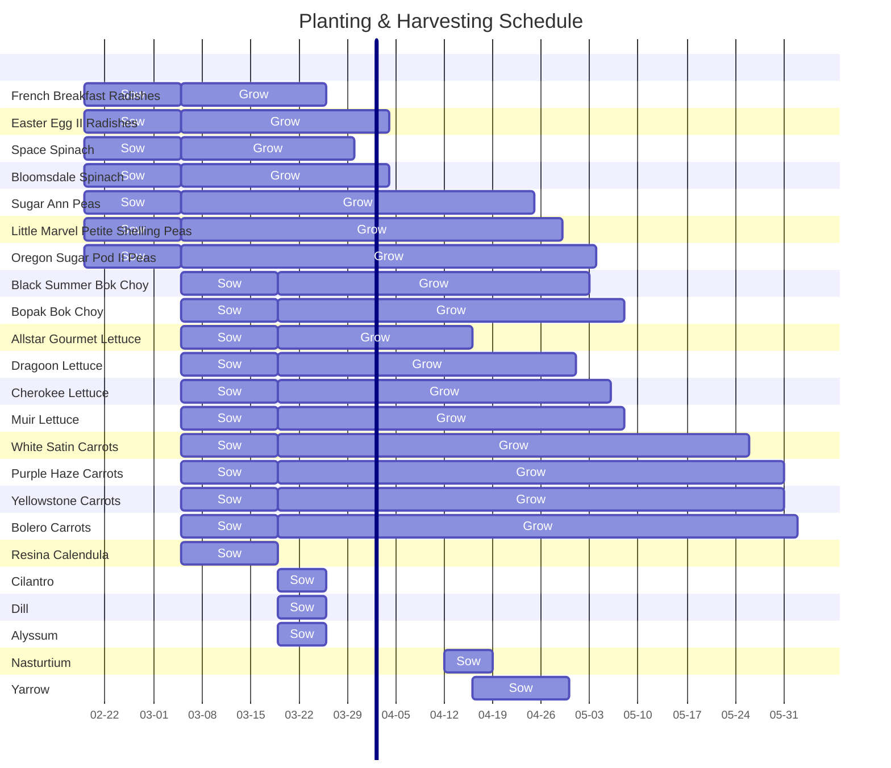

# Planting Schedule

```mermaid
---
displayMode: compact
---
gantt
    title Planting & Harvesting Schedule
    dateFormat YYYY-MM-DD
    axisFormat %m-%d
    Last Frost: vert, v1, 2026-04-02,
    Section French Breakfast Radishes
        Sow: 2026-02-19, 14d
        Grow: 2026-03-05, 21d
    Section Easter Egg II Radishes
        Sow: 2026-02-19, 14d
        Grow: 2026-03-05, 30d
    Section Space Spinach
        Sow: 2026-02-19, 14d
        Grow: 2026-03-05, 25d
    Section Bloomsdale Spinach
        Sow: 2026-02-19, 14d
        Grow: 2026-03-05, 30d
    Section Sugar Ann Peas
        Sow: 2026-02-19, 14d
        Grow: 2026-03-05, 51d
    Section Little Marvel Petite Shelling Peas
        Sow: 2026-02-19, 14d
        Grow: 2026-03-05, 55d
    Section Oregon Sugar Pod II Peas
        Sow: 2026-02-19, 14d
        Grow: 2026-03-05, 60d
    Section Black Summer Bok Choy
        Sow: 2026-03-05, 14d
        Grow: 2026-03-19, 45d
    Section Bopak Bok Choy
        Sow: 2026-03-05, 14d
        Grow: 2026-03-19, 50d
    Section Allstar Gourmet Lettuce
        Sow: 2026-03-05, 14d
        Grow: 2026-03-19, 28d
    Section Dragoon Lettuce
        Sow: 2026-03-05, 14d
        Grow: 2026-03-19, 43d
    Section Cherokee Lettuce
        Sow: 2026-03-05, 14d
        Grow: 2026-03-19, 48d
    Section Muir Lettuce
        Sow: 2026-03-05, 14d
        Grow: 2026-03-19, 50d
    Section White Satin Carrots
        Sow: 2026-03-05, 14d
        Grow: 2026-03-19, 68d
    Section Purple Haze Carrots
        Sow: 2026-03-05, 14d
        Grow: 2026-03-19, 73d
    Section Yellowstone Carrots
        Sow: 2026-03-05, 14d
        Grow: 2026-03-19, 73d
    Section Bolero Carrots
        Sow: 2026-03-05, 14d
        Grow: 2026-03-19, 75d
    Section Resina Calendula
        Sow: 2026-03-05, 14d
    Section Cilantro
        Sow: 2026-03-19, 7d
    Section Dill
        Sow: 2026-03-19, 7d
    Section Alyssum
        Sow: 2026-03-19, 7d
    Section Nasturtium
        Sow: 2026-04-12, 7d
    Section Yarrow
        Sow: 2026-04-16, 14d
```
