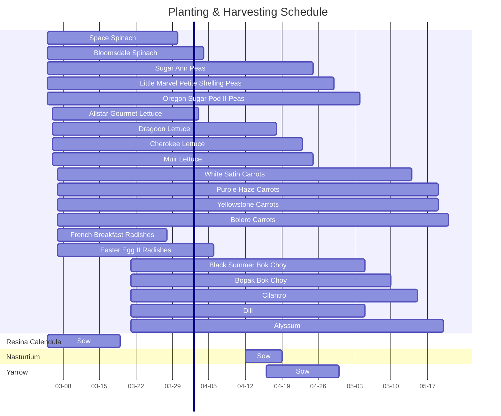

# Planting Schedule

```mermaid
---
displayMode: compact
---
gantt
    title Planting & Harvesting Schedule
    dateFormat YYYY-MM-DD
    axisFormat %m-%d
    Last Frost: vert, 2026-04-02, 0d
    Space Spinach: 2026-03-05, 25d
    Bloomsdale Spinach: 2026-03-05, 30d
    Sugar Ann Peas: 2026-03-05, 51d
    Little Marvel Petite Shelling Peas: 2026-03-05, 55d
    Oregon Sugar Pod II Peas: 2026-03-05, 60d
    Allstar Gourmet Lettuce: 2026-03-06, 28d
    Dragoon Lettuce: 2026-03-06, 43d
    Cherokee Lettuce: 2026-03-06, 48d
    Muir Lettuce: 2026-03-06, 50d
    White Satin Carrots: 2026-03-07, 68d
    Purple Haze Carrots: 2026-03-07, 73d
    Yellowstone Carrots: 2026-03-07, 73d
    Bolero Carrots: 2026-03-07, 75d
    French Breakfast Radishes: 2026-03-07, 21d
    Easter Egg II Radishes: 2026-03-07, 30d
    Black Summer Bok Choy: 2026-03-21, 45d
    Bopak Bok Choy: 2026-03-21, 50d
    Cilantro: 2026-03-21, 55d
    Dill: 2026-03-21, 45d
    Alyssum: 2026-03-21, 60d
    Section Resina Calendula
        Sow: 2026-03-05, 14d
    Section Nasturtium
        Sow: 2026-04-12, 7d
    Section Yarrow
        Sow: 2026-04-16, 14d
```
