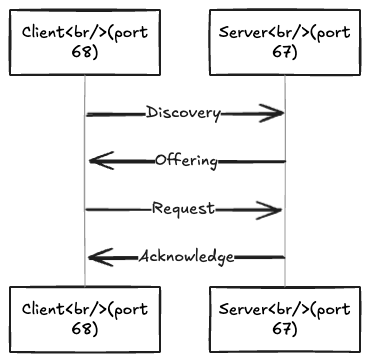

# CompTIA A+ Notes
## Mobile devices
### Mobile Device Networking
#### Mobile E-mail
| Protocol | Original Port | Secure Port |
| --- | --- | --- |
| SMTP | 25 | 465 or 587 |
| POP3 | 110 | 995 |
| IMAP | 143 | 993 |

#### Radio and ID
- History
  - Cell phones originally used GSM (Global System for Mobile communciations) for voice calls, and GPRS (General Packet Radio Service) for transmitting data (2G speeds).
  - Then, UMTC (Universal Mobile Telecommunications System) and EDGE (Enhanced Data-rates for GSM Evolution) was used to attain 3G speeds.
  - 4G and LTE speeds are possible with IMT-Advanced (International Mobile Telecommunications - Advanced) requirements.
  - 5G is currently being deployed
	- ITU IMT-2020 Standard
	- 20 Gbps Maximum
- PRL (Preferred Roaming List) updates:
  - A DB of service provider radio information.
  - Used with CDMA (Code Division Multiple Access) networks.
- Baseband updates:
  - Used with GSM.
  - Also called radio firmware.
- Acronyms
  - IMEI (International Mobile Station Equipment Identity): used to identify the device.
  - IMSI (International Mobile Subscriber Identity): used to identify the user.

## Networking
### Ports & Protocols
#### Introduction to Networking
- TCP/IP: Transmission Control Protocol / Internet Protocol
- Retrieve network info
  - Windows: ipconfig /all
  - Mac OSX: ifconfig
  - Linux: ip a
- Linux commands
  - speedtest cli 
  - nload

#### TCP vs. UDP
- TCP (Transmission Control Protocol)
  - Examples: HTTP, FTP, POP3
  - Show active connections: netstat -n
  - To query DNS: nslookup
    - Domain name lookup: nslookup example.com
    - Reverse DNS lookup: nslookup 192.0.2.1
    - Query a specific type of DNS record: nslookup -type=MX example.com
    - Domain name lookup against a specific DNS server: nslookup example.com 8.8.8.8
- UDP (User Datagram Protocol)
  - Connectionless
  - Non-guaranteed
  - Used by BitTorrents, tunneling protocols, and some streaming media
  - Show active connections: netstat -an
- Should reference IANA port number registry

#### HTTP & HTTPS
| Protocol | Full Name | Port |
| --- | --- | --- |
| HTTP | Hypertext Transfer Protocol | 80 |
| HTTPS | Hypertext Transfer Protocol Secure | 443 |

#### Email Protocols
| Protocol | Full Name | Port | Secure Port | Used For |
| --- | --- | --- | --- | --- |
| SMTP | Simple Mail Transfer Protocol | 25 | 587 or 465 | Sending email |
| POP3 | Post Office Protocol Version 3 | 110 | 995 | Receiving email; downloads emails to a single device, removing them from the server |
| IMAP | Internet Message Access Protocol | 143 | 993 | Receiving email; synchronizes emails across multiple devices by keeping them on the server

#### FTP, SSH, and Telnet
| Protocol | Full Name | Port |
| --- | --- | --- |
| FTP | File Transfer Protocol | 21 |
| FTPS | File Transfer Protocol Secure | 989/990 |
| SSH | Secure Shell | 22 |
| Telnet | Telecommunications Network | 23 |

#### DHCP (Dynamic Host Configuration Protocol)
- Gives out IP addresses to computers on the network
- Ports and flow:

#### DNS (Domain Name System)
- Accepts requests on port 53

#### LDAP & RDP
| Protocol | Full Name | Port | Secure Port | Notes |
| --- | --- | --- | --- | --- |
| LDAP | Lightweight Directory Access Protocol | 389 | 636 | Used to access and distribute directories of information |
| RDP | Remote Desktop Protocol | 3389 | 443 and others | Used for full or limited control of a remote system |
