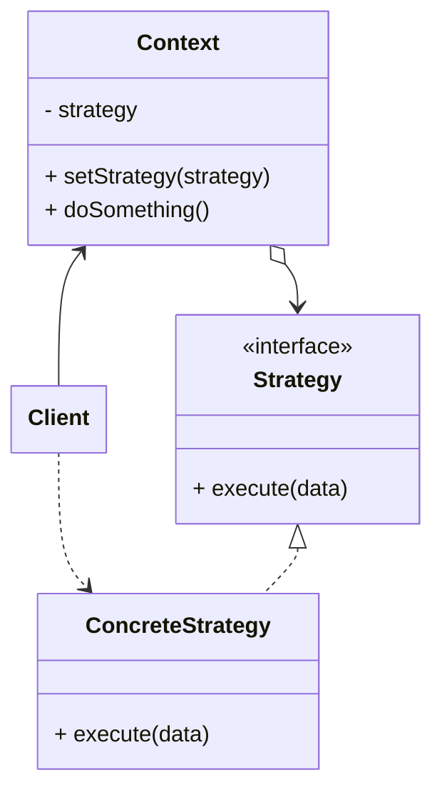

# Mermaid Test

```mermaid
%%{
  init: {
    "class": {
      "hideEmptyMembersBox": true
    }
  }
}%%
classDiagram
    Context o--> Strategy
    Context <-- Client
    Client ..> ConcreteStrategy
    Strategy <|.. ConcreteStrategy
    class Context {
        - strategy
        + setStrategy(strategy)
        + doSomething()
    }
    class Strategy {
        <<interface>>
        + execute(data)
    }
    class ConcreteStrategy {
        + execute(data)
    }
```
