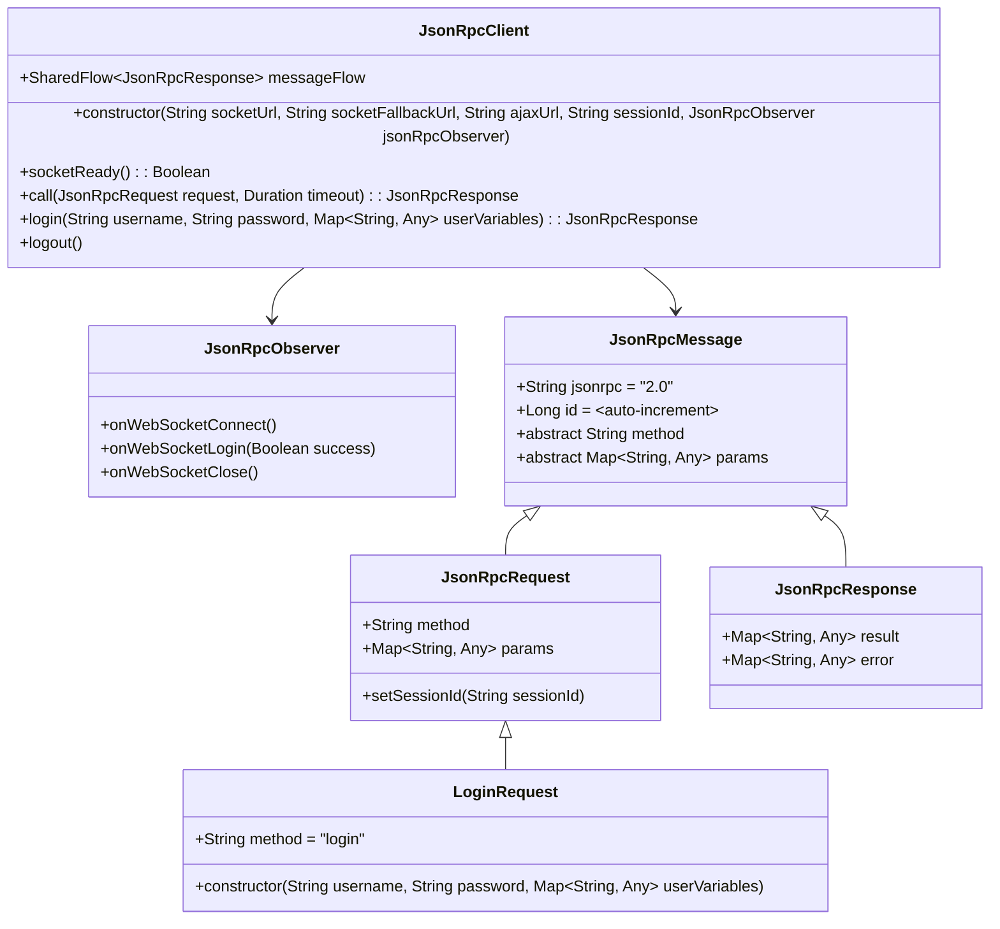
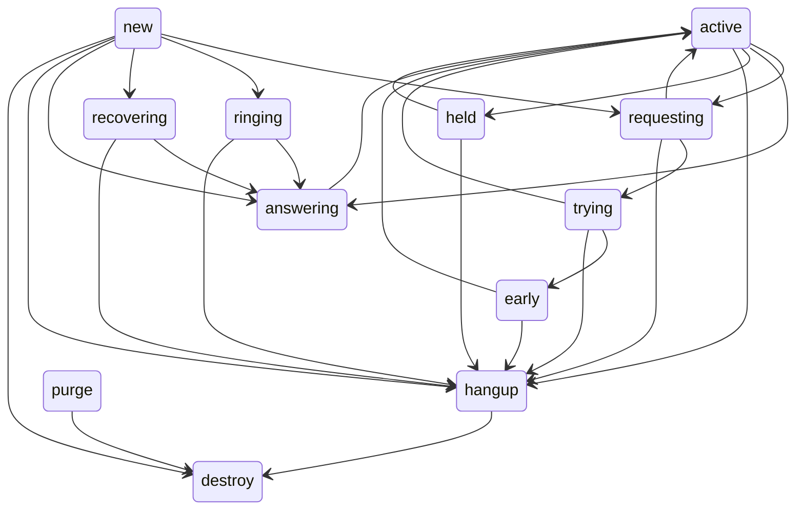

# Verto Design

- [Verto Design](#verto-design)
  - [Functionality](#functionality)
  - [Implementation](#implementation)
    - [High Level Design](#high-level-design)
    - [JsonRpcClient Design](#jsonrpcclient-design)
    - [VertoClient Design](#vertoclient-design)

## Functionality

## Implementation

### High Level Design

The Voice application for each supported platform shall consume a custom Verto signaling client built as a Kotlin Multiplatform library (verto-client). This verto-client library will in turn consume a custom JSON RPC client also built as a Kotlin Multiplatform library (jsonrpc-client) as well as a fork of the publicly available webrtc-kmp, which is a Kotlin Multiplatform wrapper for Google's standard WebRTC libraries (webrtc-android, webrtc-ios, etc.).

### JsonRpcClient Design

This library shall allow generic JSON RPC 2.0 communication using either a websocket or AJAX request. It defines the generic data model for performing JSON RPC 2.0 communication, as well as ensuring a persistent websocket connection if a websocket URL is provided.

### VertoClient Design

This is the detailed design and service contract for the Verto signaling client. It includes all of the standard functions necessary for voice calling, including video and screen sharing. The VertoClient will track a list of Dialog objects, which are responsible for maintaining the link between individual calls to their respective WebRTC peer connections, and also for updating WebRTC tracks/media as necessary.

```mermaid
classDiagram
    class VertoClient {
        +socketUrl: String?
        +socketFallbackUrl: String?
        +defaultMediaConstraints: MediaStreamConstraintsBuilder.() -> Unit
        +iceServers: List~String~?
        +sessionId: String = randomUUID()
        +callbacks: VertoObserver = DefaultVertoObserver()
        +rpcClient: JsonRpcClient
        +dialogs: Map~String, Dialog~
        +calls: StateFlow~List~Call~~
        +connectionState: StateFlow~ConnectionState~
        +authenticationState: StateFlow~AuthenticationState~
        +login(params)
        +logout()
        +subscribe(channel, params)
        +unsubscribe(channel)
        +broadcast(channel, params)
        +newCall(args, mediaConstraints: MediaStreamConstraintsBuilder.() -> Unit): Call
        +ring(callId)
        +answer(callId, params)
        +isAudioMuted(callId)
        +muteAudio(callId, muted)
        +isVideoMuted(callId)
        +muteVideo(callId, muted)
        +isOnHold(callId)
        +hold(callId, onHold, params)
        +transfer(callId, dest, params)
        +replace(callId, replaceCallId, params)
        +hangup(callId, params)
        +dtmf(callId, digits)
        +rtt(callId, code, chars)
        +setMediaConstraints(callId, mediaConstraints: MediaStreamConstraintsBuilder.() -> Unit)
        +switchCamera(callId: String, deviceId: String?)
        +isSharingScreen(callId)
        +shareScreen(callId, shared)
        +message(from: String? = null, to: String, body: String)
    }

    class ConnectionState {
        <<enumeration>>
        Disconnected
        Connecting
        Connected
    }

    class AuthenticationState {
        <<enumeration>>
        Unauthenticated
        Authenticated
    }

    class VertoObserver {
        <<interface>>
        +onWebSocketLogin(success: Boolean)
        +onWebSocketClose()
        +onMessage(dialog: Any?, message: Any?, params: Any?)
        +onEvent(params: Map~String, Any~?, userData: Any?)
        +onDialogState(dialog: Dialog)
    }

    class Dialog {
        +vertoClient: VertoClient
        +call: Call
        +peerConnection: PeerConnection
        +mediaConstraints: MediaStreamConstraintsBuilder.() -> Unit
        +invite()
        +ring()
        +answer(params)
        +isAudioMuted()
        +muteAudio(muted)
        +isVideoMuted()
        +muteVideo(muted)
        +isOnHold()
        +hold(onHold, params)
        +transfer(dest, params)
        +replace(replaceCallId, params)
        +hangup(params)
        +dtmf(digits)
        +rtt(code, chars)
        +setMediaConstraints(mediaConstraints: MediaStreamConstraintsBuilder.() -> Unit)
        +switchCamera(deviceId: String?)
        +isSharingScreen()
        +shareScreen(shared)
        +message(to: String, body: String)
    }

    class Call {
        +callId: String
        +masterCallId: String
        +direction: Direction
        +state: State
        +previousState: State
        +callerIdName: String
        +callerIdNumber: String
        +calleeIdName: String
        +calleeIdNumber: String
        +calleePilotNumber: String
        +dataServerName: String
        +rtcStatsReport: RtcStatsReport`
        +bssids: List~BSSIDRecord~
        +startTime: Long
        +endTime: Long
    }

    class BSSIDRecord {
        bssid: String
        changeTime: Long
    }

    class Direction {
        <<enumeration>>
        Inbound
        Outbound
    }

    class State {
        <<enumeration>>
        New
        Requesting
        Recovering
        Trying
        Ringing
        Answering
        Active
        Held
        Early
        Hangup
        Destroy
        Purge
    }
```

Both the VertoClient and associated Dialogs will make use of the below outlined internal JsonRpcRequest implementations for all necessary communication with mod_verto in FreeSwitch.

```mermaid
classDiagram
    JsonRpcRequest <|-- VertoBroadcastRequest
    JsonRpcRequest <|-- VertoSubscribeRequest
    JsonRpcRequest <|-- VertoUnsubscribeRequest
    JsonRpcRequest <|-- VertoDialogRequest
    VertoDialogRequest <|-- VertoInfoRequest
    VertoDialogRequest <|-- VertoInviteRequest
    VertoDialogRequest <|-- VertoAnswerRequest
    VertoDialogRequest <|-- VertoAttachRequest
    VertoDialogRequest <|-- VertoByeRequest
    VertoDialogRequest <|-- VertoModifyRequest
    VertoInfoRequest <|-- VertoDtmfRequest
    VertoInfoRequest <|-- VertoRttRequest
    VertoInfoRequest <|-- VertoMessageRequest
    VertoModifyRequest <|-- VertoTransferRequest
    VertoModifyRequest <|-- VertoReplaceRequest
    VertoModifyRequest <|-- VertoHoldRequest
    VertoModifyRequest <|-- VertoUnholdRequest
    VertoModifyRequest <|-- VertoToggleHoldRequest

    class VertoBroadcastRequest {
        +method: String = "verto.broadcast"
    }

    class VertoSubscribeRequest {
        +method: String = "verto.subscribe"
    }

    class VertoUnsubscribeRequest {
        +method: String = "verto.unsubscribe"
    }

    class VertoDialogRequest {
        <<abstract>>
        +method: String
        +dialog: Dialog?
    }

    class VertoInfoRequest {
        <<abstract>>
        +method: String = "verto.info"
    }

    class VertoInviteRequest {
        +method: String = "verto.invite"
        +sdp: String
    }

    class VertoAnswerRequest {
        +method: String = "verto.answer"
        +sdp: String
    }

    class VertoAttachRequest {
        +method: String = "verto.attach"
        +sdp: String
    }

    class VertoByeRequest {
        +method: String = "verto.bye"
    }

    class VertoModifyRequest {
        <<abstract>>
        +method: String = "verto.modify"
    }

    class VertoDtmfRequest {
        +digits: String
    }

    class VertoRttRequest {
        +text: String
    }

    class VertoMessageRequest {
        +to: String
        +body: String
    }

    class VertoTransferRequest {
        +action: String = "transfer"
        +destination: String
    }

    class VertoReplaceRequest {
        +action: String = "replace"
        +replaceCallId: String
    }

    class VertoHoldRequest {
        +action: String = "hold"
    }

    class VertoUnholdRequest {
        +action: String = "unhold"
    }

    class VertoToggleHoldRequest {
        +action: String = "toggleHold"
    }
```

Each individual call dialog has a number of states that it can flow through as part of a call workflow. Below is a state diagram detailing each state and its corresponding valid next states.

Below is a sequence diagram showing Verto signaling and call state for a basic scenario.

